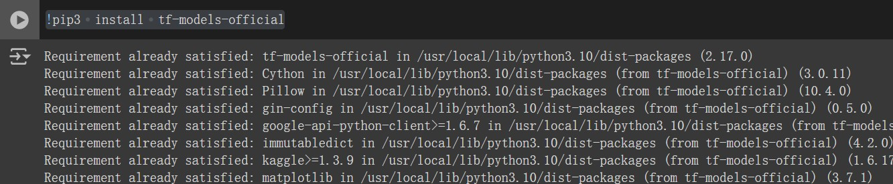
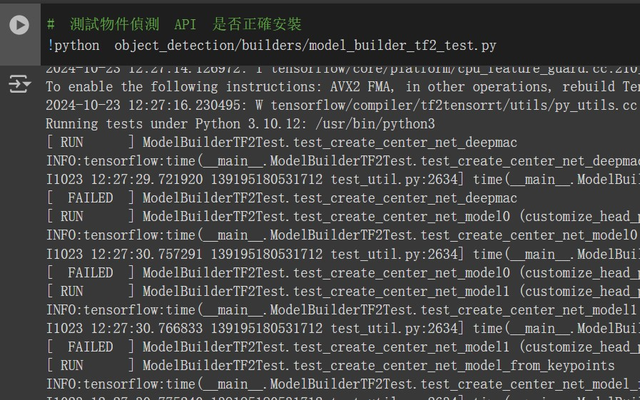
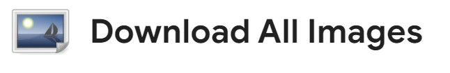
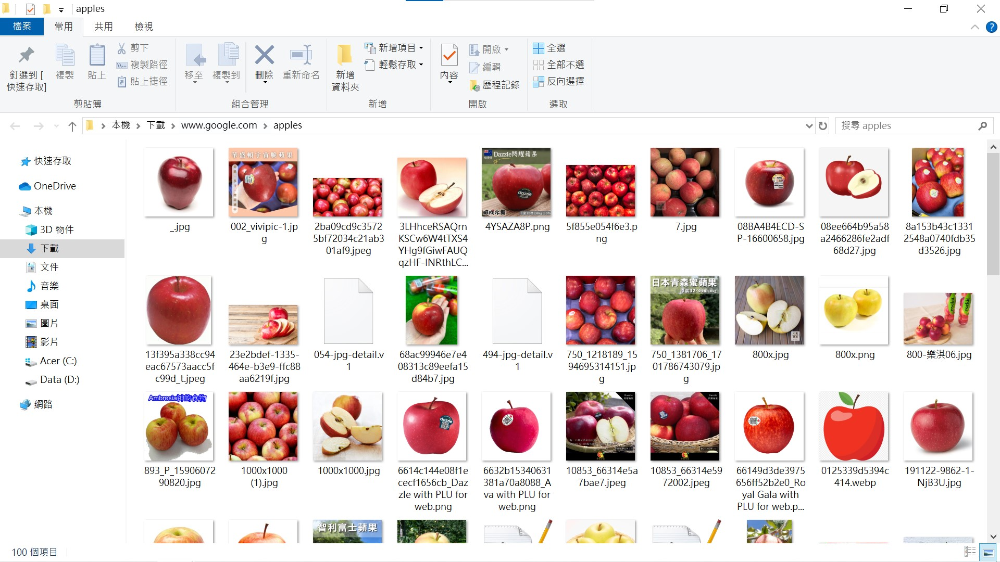
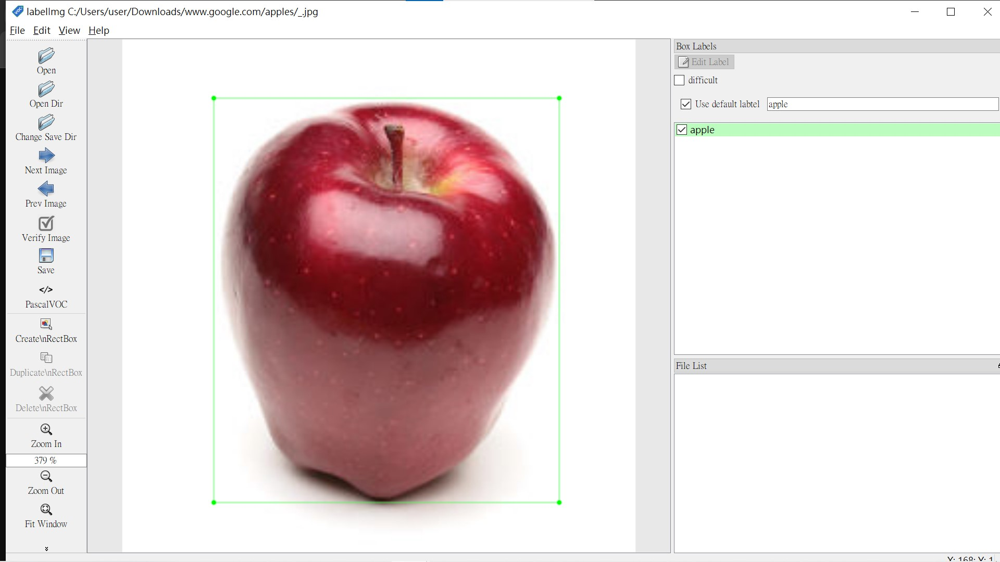
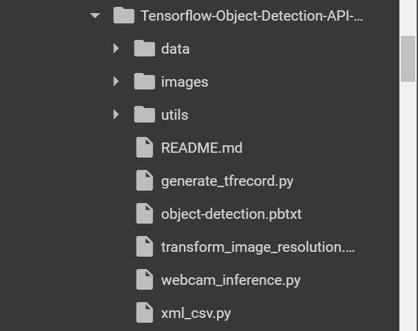
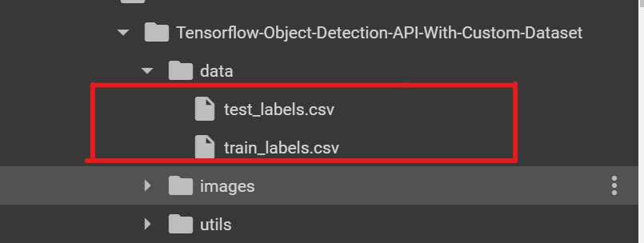
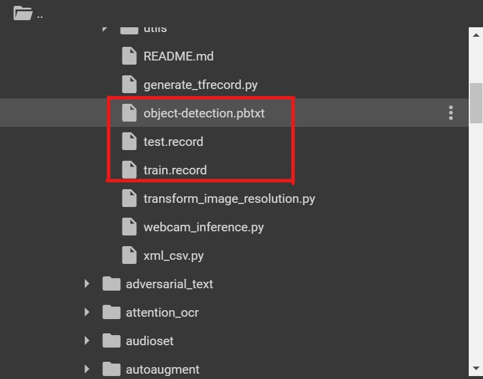

tensorflow圖形檢測_使用Google Colab使用Tensorflow進行自定義對象檢測
--------------------------------------------------------------------
#### 跨領域-人工智慧期中報告 11124112 林郁翔

本文是關於如何使用 TensorFlow 物件偵測 API 建立自訂物件偵測器的詳細步驟，從安裝環境、資料收集、標註資料、產生 TFRecords 到訓練模型和測試物件偵測器，我們將使用Tensorflow物件來偵測API建立自訂物件偵測器，我將選擇檢測蘋果果實，但是您可以選擇要偵測自己的自訂物件的任何影像。

## 摘要中的主要步驟：
1. 安裝環境
2. 數據收集
3. 數據標註
4. 產生用於訓練的 TFRecord
5. 訓練配置
6. 模型訓練
7. 導出推論圖
8. 物體探測測試

設定Google Colab環境
------------------------------
確保您有Python 3.6或更高版本

tf-models-official 是穩定的 Model Garden 包

pip3 將自動安裝所有模型和依賴項。
```
!pip3 install tf-models-official
```



如果您有可與 Tensorflow 一起使用的 GPU:
```
pip install tensorflow-gpu
```
*Other dependencies*
```
!sudo apt-get install protobuf-compiler python3-pil python3-lxml python3-tk git
!pip3 install pillow Cython lxml jupyter matplotlib contextlib2
!pip3 install --user -r models/official/requirements.txt
!pip install tensorflow-io
!pip3 install pycocotools
```
複製TensorFlow模型倉庫運行以下程式碼，克隆```TensorFlow```模型庫並進入```research```目錄：
```
!git clone https://github.com/tensorflow/models.git
```
Protobuf編譯
-------------
Protobuf編譯: Tensorflow物件偵測API使用Protobufs配置模型和訓練參數。在使用該框架之前，必須先編譯Protobuf函式庫。這應該透過從tensorflow / models / research /目錄執行以下命令來完成：


克隆 tf models 儲存庫後，現在轉到research資料夾
```
%cd models/research
```
```
# From tensorflow/models/research/
!protoc object_detection/protos/*.proto --python_out=.
```
將庫加入到PYTHONPATH在google colab運行時，應將TFmodels / research /和slim目錄附加到PYTHONPATH(使用 os.environ 設定 Python 路徑)
```
# From tensorflow/models/research/
import os
os.environ['PYTHONPATH'] += ":/content/drive/MyDrive/113-ai/models/research:/content/drive/MyDrive/113-ai/models/research/slim"
```
### *note :*
該命令需要從您啟動的每個新終端運行。如果您希望避免手動運行它，可以將其作為新行添加到 ~/.bashrc 檔案的末尾，將 pwd 替換為系統上的 tensorflow/models/research 的絕對路徑

物體偵測安裝&測試安裝
---------------
```
!pip install tf-slim

# 測試物件偵測 API 是否正確安裝
!python object_detection/builders/model_builder_tf2_test.py
```



Gathering data
-------------------------
2.1 開啟您的google chrome瀏覽器並安裝一個名為Download All Images的擴充功能。


2.2 現在在Google圖片中搜尋所需的圖片選擇，在我的例子中是「 Apple」。現在，按一下「下載所有圖像」擴充功能按鈕，該按鈕將位於瀏覽器的右上角。您將獲得一個包含圖像的zip檔。然後將其提取。





Labeling data
----------------
打開您的終端並透過以下方式安裝LabelImg，LabelImg是圖形影像註解工具，安裝labelImg後，透過鍵入將其打開
```
!pip3 install labelImg
```

上面的內容。並對所有圖片執行此操作。它正在做的是，它正在產生一個XML文件，其中包含帶有其標籤的物件座標，標記了約100張圖片，現在克隆儲存庫
```zjgulai/Tensorflow-Object-Detection-API-With-Custom-Datasetgithub.com```
```
!git clone https://github.com/zjgulai/Tensorflow-Object-Detection-API-With-Custom-Dataset.git
```


### 克隆之後進入目錄：
```
%cd models/research/Tensorflow-Object-Detection-API-With-Custom-Dataset
```


Generating TFRecords for training
-----------------------------------
現在，將圖像檔案的70％複製到訓練資料夾圖像/訓練中，其餘30％複製到測試資料夾中。
標記影像後，我們需要建立 TFRecord，將其用作目標偵測器訓練的輸入資料。為了建立 TFRecords，我們將使用```datitran/raccoon_datasetgithub.com```中的兩個腳本
```xml_to_csv.py```和```generate_tfrecord.py```檔現在在該資料夾中，我們可以透過開啟命令列並鍵入以下內容，將XML檔案轉換為```train_label.csv```和```test_label.csv```：


```
!python xml_csv.py
```




它們在資料目錄中會建立兩個檔案。一個叫做```test_labels.csv```，另一個叫做```train_labels.csv```
在將新建立的檔案轉換為TFRecords之前，我們需要更改```generate_tfrecords.py```檔案中的幾行。
```
# TO-DO replace this with label map , replace with your own classes
def class_text_to_int(row_label):
    if row_label == 'apple':
        return 1
    else:
        return 0
```
如果你有多類標記：
```
# TO-DO replace this with label map
def class_text_to_int(row_label):
    if row_label == 'apple':
        return 1
    elif row_label == 'banana':
        return 2
    elif row_label == 'orange':
        return 3
    else:
        return None
```

現在，您可以透過鍵入以下內容來產生 TFRecords：
-----------------------------
```
python3 generate_tfrecord.py --csv_input=data/train_labels.csv  --output_path=train.record --image_dir=images/train
python3 generate_tfrecord.py --csv_input=data/test_labels.csv  --output_path=test.record --image_dir=images/test
```
這兩個指令產生一個```train.record```和一個```test.record```文件，可用來訓練我們的物件偵測器。


訓練配置
-----------------------
在訓練之前，我們要做的最後一件事是```create a label map ```and a ```training configuration file``` .

建立標籤圖
-----------------------
標籤映射映射： id 到 name。我已經為我的訓練創建了一個標籤圖檔案。它看起來像這樣：


編輯：```object-detection.pbtxt```:
```
item{
  id:1
  name:"apple"
}
```
如果您使用多個類，請遵循此模式
```
item {
    id: 1
    name: 'apple'
}
item {
    id: 2
    name: 'banana'
}
item {
    id: 3
    name: 'orange'
}
item {
    id: 4
    name: 'etc'
}
```
每個類別的ID號碼應與 _generate_tfrecord.py_ 檔案中指定的ID相符。


建立訓練配置
-----------
我們將在Google Colab中訓練我們的模型[在 Colab 中打開](https://colab.research.google.com/drive/1o7JB0pWanEMn6qnRnEXphu0T4YbuKLL2 "在 Colab 中打開")，匯出中我使用「SSD MOBILENET V2」進行訓練，批次大小為 4。您可以變更步驟數、要使用的預訓練模型以及批次和大小。在此之下，您需要上傳生成的```train.record```、```test.record```和```object-detection.pbtxt```檔案。





訓練模型
---------
現在，在上傳所有這些文件之後，運行下面的所有單元格。它將得到訓練。


導出推理圖
-------------
如果已執行所有單元，則最後將下載一個名為Frozen_inference_graph.pb的檔案。


測試物體探測器
-----------
現在，將Frozen_inference_graph.pb檔案複製到我的GitHub克隆資料夾中。然後，您需要在該webcam_inference.py中進行一些編輯，以測試您自己的物件偵測器。打開該文件並檢查代碼。
如果您正確執行了上述所有步驟，則可以透過網路攝影機測試模型。


結論
-----------
Tensorflow 物件偵測 API 可讓您使用遷移學習技術建立自己的物件偵測器。
這是獲取代碼的連結。
